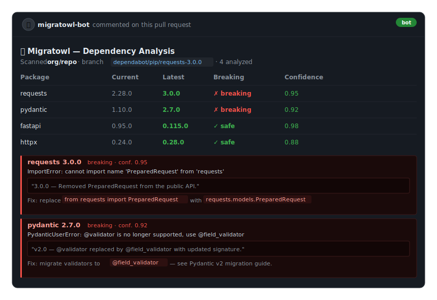

<p align="center">
  
</p>

<h1 align="center">Migratowl</h1>

<p align="center">
  <strong>AI-powered dependency migration analyzer.</strong><br>
  Discovers breaking upgrades, explains exactly what failed, and tells you how to fix it.
</p>

<p align="center">
  
  
  <a href="https://www.bestpractices.dev/projects/12571"></a>
</p>

---

<p align="center">
  
</p>

---

## What It Does

Migratowl answers one question: **"If I upgrade this dependency, will anything break — and how do I fix it?"**

It receives a webhook, clones the target repository, scans all dependency manifests, queries package registries for newer versions, and runs the project inside an isolated Kubernetes sandbox with every dependency bumped. An AI agent executes the test suite, reads the error output, fetches the relevant changelog, and produces a structured report per dependency.

The result tells developers:

- Whether the upgrade is breaking
- What specifically went wrong
- A verbatim citation from the changelog
- A plain-English fix suggestion
- A confidence score (0.0–1.0)

---

## Table of Contents

- [What It Does](#what-it-does)
- [Table of Contents](#table-of-contents)
- [Supported Ecosystems](#supported-ecosystems)
- [How It Works](#how-it-works)
- [Quick Start](#quick-start)
- [API Reference](#api-reference)
  - [POST /webhook](#post-webhook)
  - [GET /jobs/{job\_id}](#get-jobsjob_id)
  - [GET /healthz](#get-healthz)
- [Response Schema](#response-schema)
- [Configuration](#configuration)
  - [LLM](#llm)
  - [Kubernetes Sandbox](#kubernetes-sandbox)
  - [Analysis](#analysis)
  - [HTTP Client](#http-client)
  - [API Server](#api-server)
  - [Git Providers](#git-providers)
  - [Observability](#observability)
- [Kubernetes Setup](#kubernetes-setup)
- [Observability](#observability-1)
- [GitHub Actions](#github-actions)
- [Architecture](#architecture)
- [Project Layout](#project-layout)
- [Development](#development)
- [Contributing](#contributing)
- [License](#license)

---

## Supported Ecosystems

| Language | Manifest files | Registry |
|----------|----------------|----------|
| Python | `pyproject.toml`, `requirements.txt` | PyPI |
| Node.js | `package.json` | npm |
| Go | `go.mod` | proxy.golang.org |
| Rust | `Cargo.toml` | crates.io |
| Java | `pom.xml` (Maven), `build.gradle` (Gradle) | Maven Central |

---

## How It Works

Migratowl runs a four-phase agent workflow inside an ephemeral Kubernetes sandbox.

```text
POST /webhook
     │
     ▼
┌─────────────────────────────────────────────────────────┐
│  Phase 1 — Setup                                        │
│                                                         │
│  clone_repo ──► detect_languages ──► scan_dependencies  │
│                                           │             │
│                                    check_outdated_deps  │
└─────────────────────────┬───────────────────────────────┘
                          │ outdated dep list
                          ▼
┌─────────────────────────────────────────────────────────┐
│  Phase 2 — Main Analysis                                │
│                                                         │
│  copy_source("main") ──► update_dependencies (all)      │
│                               │                         │
│                        execute_project (install + test) │
└─────────────────────────┬───────────────────────────────┘
                          │ pass / fail + error output
                          ▼
┌─────────────────────────────────────────────────────────┐
│  Phase 3 — Confidence Scoring                           │
│                                                         │
│  All pass ──► every package: is_breaking=false, conf=1  │
│                                                         │
│  Some fail ──► assign confidence per package            │
│    conf ≥ threshold ──► fetch_changelog + write report  │
│    conf < threshold ──► delegate to package-analyzer    │
│                          subagent (isolated run)        │
└─────────────────────────┬───────────────────────────────┘
                          │ AnalysisReport[]
                          ▼
┌─────────────────────────────────────────────────────────┐
│  Phase 4 — Compile Results                              │
│                                                         │
│  Merge reports from main agent + subagents              │
│  ──► ScanAnalysisReport (POST to callback_url)          │
└─────────────────────────────────────────────────────────┘
```

**Confidence scoring rules** (applied in Phase 3 when tests fail):

- Error message directly names the package → high confidence (≥ 0.8)
- Import or attribute error for a known package API → high confidence
- Major version jump (e.g. `2.x → 3.x`) → moderate confidence boost
- Generic failure with no clear link → low confidence (< 0.5)

The default confidence threshold is `0.7` (configurable via `MIGRATOWL_CONFIDENCE_THRESHOLD`).

**Sandbox workspace layout:**

```text
/home/user/workspace/
├── source/          # Immutable clone — never executed
├── main/            # All deps bumped, executed in Phase 2
└── <package-name>/  # Per-package isolation (created on demand by subagent)
```

---

## Quick Start

**Prerequisites:** Python 3.13+, [uv](https://docs.astral.sh/uv/), Docker, minikube, kubectl.

```bash
# 1. Install dependencies
uv sync

# 2. Configure environment
cp .env.example .env
# Edit .env — set at minimum: ANTHROPIC_API_KEY

# 3. Start local Kubernetes cluster
minikube start --driver=docker --memory=8192 --cpus=4

# 4. Install agent-sandbox controller and CRDs
kubectl apply -f https://github.com/kubernetes-sigs/agent-sandbox/releases/download/v0.1.0/manifest.yaml
kubectl apply -f https://github.com/kubernetes-sigs/agent-sandbox/releases/download/v0.1.0/extensions.yaml

# 5. Build sandbox runner image inside minikube
eval $(minikube docker-env)
docker build -t sandbox-runtime:latest k8s/runtime/

# 6. Apply RBAC and sandbox template
kubectl apply -f k8s/rbac.yaml
kubectl apply -f k8s/sandbox-template.yaml

# 7. Start the server
uv run uvicorn migratowl.api.main:app --reload
```

Trigger a scan:

```bash
curl -X POST http://localhost:8000/webhook \
  -H 'Content-Type: application/json' \
  -d '{
    "repo_url": "https://github.com/org/repo",
    "callback_url": "https://yourservice.example.com/results"
  }'
# → {"job_id": "...", "status_url": "/jobs/..."}
```

---

## API Reference

### POST /webhook

Accepts a scan request. Returns `202 Accepted` immediately; analysis runs in the background and POSTs the result to `callback_url` when done.

**Request body** (`ScanWebhookPayload`):

| Field | Type | Default | Description |
|-------|------|---------|-------------|
| `repo_url` | `string` | **required** | Git repository URL to scan |
| `branch_name` | `string` | `"main"` | Branch to clone and analyze |
| `git_provider` | `"github" \| "gitlab"` | `"github"` | Git provider — determines which API is used for PR/MR comments and commit statuses |
| `pr_number` | `integer \| null` | `null` | PR (GitHub) or MR IID (GitLab) — when set, Migratowl posts a comment with the analysis result |
| `commit_sha` | `string \| null` | `null` | Full commit SHA — when set, Migratowl posts a pending status at scan start and a success/failure status on completion |
| `callback_url` | `string \| null` | `null` | URL to POST `ScanAnalysisReport` on completion |
| `exclude_deps` | `string[]` | `[]` | Dependency names to skip entirely |
| `check_deps` | `string[]` | `[]` | When non-empty, only these dependencies are checked (all others are ignored) |
| `max_deps` | `integer` | `50` | Maximum outdated deps to analyze (must be > 0) |
| `ecosystems` | `string[] \| null` | `null` | Limit to specific ecosystems: `"python"`, `"nodejs"`, `"go"`, `"rust"`, `"java"`. `null` = auto-detect all |
| `mode` | `string` | `"normal"` | Version resolution mode — see below |
| `include_prerelease` | `boolean` | `false` | When `true`, pre-release versions (alpha, beta, RC) are considered when finding the latest version |

**Version resolution modes (`mode`):**

| Mode | Behaviour |
|------|-----------|
| `"safe"` | Respects the declared semver constraint. `^4.21.2` only reports a newer version if one exists **within** the `>=4.21.2,<5.0.0` range. A package already at the top of its pinned range is reported as up-to-date even when a new major exists. |
| `"normal"` | Ignores the constraint operator. `^4.21.2` compares the bare version `4.21.2` against the **globally highest** published version — including major bumps like `5.x`. |

**Example:**

```json
{
  "repo_url": "https://github.com/org/repo",
  "branch_name": "main",
  "git_provider": "github",
  "pr_number": 42,
  "commit_sha": "abc123...",
  "callback_url": "https://yourservice.example.com/results",
  "exclude_deps": ["boto3"],
  "check_deps": [],
  "max_deps": 20,
  "ecosystems": ["python"],
  "mode": "normal",
  "include_prerelease": false
}
```

**202 response** (`WebhookAcceptedResponse`):

```json
{
  "job_id": "3fa85f64-5717-4562-b3fc-2c963f66afa6",
  "status_url": "/jobs/3fa85f64-5717-4562-b3fc-2c963f66afa6"
}
```

---

### GET /jobs/{job_id}

Poll the status of a scan job.

**Response** (`JobStatus`):

| Field | Type | Description |
|-------|------|-------------|
| `job_id` | `string` | UUID assigned at webhook acceptance |
| `state` | `string` | Job lifecycle state (see below) |
| `created_at` | `datetime` | ISO 8601, UTC |
| `updated_at` | `datetime` | ISO 8601, UTC |
| `payload` | `ScanWebhookPayload` | Original request payload |
| `result` | `ScanAnalysisReport \| null` | Set when `state = "completed"` |
| `error` | `string \| null` | Set when `state = "failed"` |

**Job lifecycle:**

```text
PENDING ──► RUNNING ──► COMPLETED
                   └──► FAILED
```

| State | Meaning |
|-------|---------|
| `pending` | Queued, not yet started (v1 runs one scan at a time) |
| `running` | Agent is actively analyzing the repository |
| `completed` | Analysis finished; `result` is populated |
| `failed` | Unrecoverable error; `error` describes what went wrong |

**404** when `job_id` is not found.

---

### GET /healthz

Liveness check. Returns `200 {"status": "ok"}` when the server is running.

---

## Response Schema

The `ScanAnalysisReport` delivered to `callback_url` (and returned in `GET /jobs/{job_id}` when completed):

```text
ScanAnalysisReport
├── repo_url                  string    — repository that was analyzed
├── branch_name               string    — branch that was cloned
├── scan_result               ScanResult
│   ├── all_deps              Dependency[]   — every declared dependency found
│   │   ├── name              string
│   │   ├── current_version   string
│   │   ├── ecosystem         string
│   │   └── manifest_path     string
│   ├── outdated              OutdatedDependency[]  — deps with newer versions
│   │   ├── name              string
│   │   ├── current_version   string
│   │   ├── latest_version    string
│   │   ├── ecosystem         string
│   │   ├── manifest_path     string
│   │   ├── homepage_url      string | null
│   │   ├── repository_url    string | null
│   │   └── changelog_url     string | null
│   ├── manifests_found       string[]  — manifest file paths discovered
│   └── scan_duration_seconds float
├── reports                   AnalysisReport[]  — one per analyzed package
│   ├── dependency_name       string
│   ├── is_breaking           bool
│   ├── error_summary         string    — what failed (empty if not breaking)
│   ├── changelog_citation    string    — verbatim excerpt from changelog
│   ├── suggested_human_fix   string    — plain-English remediation step
│   └── confidence            float     — 0.0–1.0
├── skipped                   string[]  — package names not analyzed
└── total_duration_seconds    float
```

**Example report entry:**

```json
{
  "dependency_name": "requests",
  "is_breaking": true,
  "error_summary": "ImportError: cannot import name 'PreparedRequest'",
  "changelog_citation": "## 3.0.0 — Removed PreparedRequest from the public API.",
  "suggested_human_fix": "Replace `from requests import PreparedRequest` with `requests.models.PreparedRequest`.",
  "confidence": 0.95
}
```

---

## Configuration

All `MIGRATOWL_*` variables are optional (defaults shown). Third-party SDK keys use their standard names without the `MIGRATOWL_` prefix.

### LLM

| Variable | Default | Description |
|----------|---------|-------------|
| `ANTHROPIC_API_KEY` | — | Required when `MIGRATOWL_MODEL_PROVIDER=anthropic` (default) |
| `OPENAI_API_KEY` | — | Required when `MIGRATOWL_MODEL_PROVIDER=openai` |
| `MIGRATOWL_MODEL_PROVIDER` | `anthropic` | LLM provider: `anthropic` or `openai` |
| `MIGRATOWL_MODEL_NAME` | `claude-sonnet-4-6` | Model name (must match provider) |
| `MIGRATOWL_MODEL_RATE_LIMIT_RPS` | `0.1` | Max LLM requests/second (0.1 = 6 req/min) |
| `ANTHROPIC_BASE_URL` | — | Custom base URL for Anthropic API |
| `OPENAI_BASE_URL` | — | Custom base URL for OpenAI API |

### Kubernetes Sandbox

| Variable | Default | Description |
|----------|---------|-------------|
| `MIGRATOWL_SANDBOX_MODE` | `agent-sandbox` | `agent-sandbox` (requires controller + CRDs) or `raw` (any cluster, no CRDs) |
| `MIGRATOWL_SANDBOX_TEMPLATE` | `migratowl-sandbox-template` | agent-sandbox `AgentSandboxTemplate` name (agent-sandbox mode only) |
| `MIGRATOWL_SANDBOX_NAMESPACE` | `default` | Kubernetes namespace for sandbox pods |
| `MIGRATOWL_SANDBOX_CONNECTION_MODE` | `tunnel` | Connection mode: `tunnel` or `direct` (agent-sandbox mode only) |
| `MIGRATOWL_SANDBOX_IMAGE` | `python:3.12-slim` | Container image for sandbox pods (raw mode only). Must include the runtime for the target ecosystem — e.g. `python:3.13-slim`, `node:22-slim`, `golang:1.24-bookworm`, `rust:1.86-slim`, `maven:3.9-eclipse-temurin-21-alpine`. For mixed-ecosystem repos use a fat image that bundles all runtimes (see `k8s/runtime/`). |
| `MIGRATOWL_SANDBOX_BLOCK_NETWORK` | `true` | Attach deny-all `NetworkPolicy` to sandbox pods (raw mode only; requires Calico/Cilium — kindnet ignores it) |
| `MIGRATOWL_WORKSPACE_PATH` | `/home/user/workspace` | Workspace root inside the sandbox |

### Analysis

| Variable | Default | Description |
|----------|---------|-------------|
| `MIGRATOWL_CONFIDENCE_THRESHOLD` | `0.7` | Packages above this are analyzed directly; below → subagent |
| `MIGRATOWL_SCAN_REGISTRY_CONCURRENCY` | `10` | Concurrent registry queries when checking outdated deps |
| `MIGRATOWL_MAX_OUTPUT_CHARS` | `30000` | Truncation limit for sandbox command output |
| `MIGRATOWL_MAX_CHANGELOG_CHARS` | `15000` | Truncation limit for fetched changelogs |
| `MIGRATOWL_MAX_OUTDATED_DEPS` | `100` | Hard cap on registry scan results |

### HTTP Client

| Variable | Default | Description |
|----------|---------|-------------|
| `MIGRATOWL_HTTP_TIMEOUT` | `30.0` | Outbound request timeout (seconds) |
| `MIGRATOWL_HTTP_RETRY_COUNT` | `3` | Retries on 429 / 5xx responses |
| `MIGRATOWL_HTTP_RETRY_BACKOFF_BASE` | `0.5` | Base delay (seconds) for exponential backoff |

### API Server

| Variable | Default | Description |
|----------|---------|-------------|
| `MIGRATOWL_API_HOST` | `0.0.0.0` | Bind address |
| `MIGRATOWL_API_PORT` | `8000` | Bind port |

### Git Providers

| Variable | Default | Description |
|----------|---------|-------------|
| `GITHUB_TOKEN` | — | GitHub personal access token; needs `repo:status` and `public_repo` (or `repo` for private repos) scopes to post PR comments and commit statuses |
| `GITHUB_API_URL` | `https://api.github.com` | Override for GitHub Enterprise Server (e.g. `https://github.corp.com/api/v3`) |
| `GITLAB_TOKEN` | — | GitLab personal access token with `api` scope; needed to post MR comments and commit statuses |
| `GITLAB_API_URL` | `https://gitlab.com/api/v4` | Override for self-hosted GitLab |

### Observability

| Variable | Default | Description |
|----------|---------|-------------|
| `LANGFUSE_PUBLIC_KEY` | — | Enables LangFuse tracing when both keys are set |
| `LANGFUSE_SECRET_KEY` | — | See above |
| `LANGFUSE_HOST` | `https://cloud.langfuse.com` | LangFuse instance URL |

---

## Kubernetes Setup

Migratowl uses [langchain-kubernetes](https://github.com/bitkaio/langchain-kubernetes) in **agent-sandbox mode** by default, which requires the [`kubernetes-sigs/agent-sandbox`](https://github.com/kubernetes-sigs/agent-sandbox) controller and CRDs installed in your cluster. This provides warm pod pools and gVisor/Kata isolation.

```bash
# Install controller + CRDs (one-time)
kubectl apply -f https://github.com/kubernetes-sigs/agent-sandbox/releases/download/v0.1.0/manifest.yaml
kubectl apply -f https://github.com/kubernetes-sigs/agent-sandbox/releases/download/v0.1.0/extensions.yaml

# Build runtime image (must be visible to the cluster — use minikube docker-env locally)
eval $(minikube docker-env)
docker build -t sandbox-runtime:latest k8s/runtime/

# Apply manifests
kubectl apply -f k8s/rbac.yaml
kubectl apply -f k8s/sandbox-template.yaml
```

**Optional warm pool** (reduces cold-start latency):

```bash
kubectl apply -f k8s/warm-pool.yaml
```

**Raw mode** — if you can't install the agent-sandbox controller (locked-down clusters, CI environments), switch to raw mode. No CRDs required — Migratowl manages ephemeral pods directly:

```bash
MIGRATOWL_SANDBOX_MODE=raw          # set in .env
MIGRATOWL_SANDBOX_IMAGE=python:3.12-slim
MIGRATOWL_SANDBOX_BLOCK_NETWORK=true  # requires Calico/Cilium; set false for kind (kindnet ignores NetworkPolicy)
```

Apply the raw-mode RBAC instead of the default one:

```bash
kubectl apply -f k8s/rbac-raw.yaml
```

**Security defaults applied to every pod:**

- `runAsNonRoot: true`, `runAsUser: 1000`
- `allowPrivilegeEscalation: false`, `capabilities.drop: [ALL]`
- `automountServiceAccountToken: false`
- Deny-all `NetworkPolicy` (ingress + egress)

---

## Observability

Migratowl integrates with [LangFuse](https://langfuse.com) for trace-level observability. Tracing is off by default and activates when both keys are present.

```bash
# .env
LANGFUSE_PUBLIC_KEY=pk-lf-...
LANGFUSE_SECRET_KEY=sk-lf-...
LANGFUSE_HOST=https://cloud.langfuse.com   # or your self-hosted instance
```

When enabled, every scan produces a LangFuse session (keyed by `job_id`) containing:

- **Main agent trace** — all LLM calls and tool invocations
- **Tool call spans** — `clone_repo`, `scan_dependencies`, `execute_project`, etc.
- **Subagent spans** — `package-analyzer` subagent runs nested under the parent trace

No additional code changes are needed — the `observability.py` module initializes the handler at startup and patches the LangGraph graph to inject session IDs automatically.

---

## GitHub Actions

Two ready-to-use example workflows are in [`docs/examples/`](docs/examples/). Both trigger on Dependabot PRs (targeted single-dep scan) and on `workflow_dispatch` (manual full scan).

### Option A — No server needed (`ci-only.yml`)

Spins up a temporary kind cluster and Migratowl instance inside the runner. Nothing to host.

**Setup (2 steps):**

1. Copy [`docs/examples/ci-only.yml`](docs/examples/ci-only.yml) into `.github/workflows/` in your repo
2. Add one repository secret: `ANTHROPIC_API_KEY` (Settings → Secrets and variables → Actions → New repository secret)

That's it. The built-in `GITHUB_TOKEN` is used automatically for PR comments.

### Option B — Persistent Migratowl server (`with-migratowl-server.yml`)

Triggers your existing Migratowl deployment via webhook. Near-instant trigger, no cluster spin-up in CI.

**Setup:**

1. Copy [`docs/examples/with-migratowl-server.yml`](docs/examples/with-migratowl-server.yml) into `.github/workflows/`
2. Add a repository Actions variable `MIGRATOWL_URL` pointing at your deployment (Settings → Secrets and variables → Actions → Variables), e.g. `https://migratowl.yourcompany.com`
3. Ensure your Migratowl instance has `GITHUB_TOKEN` set with `repo:status` and `public_repo` scopes (or `repo` for private repos)

**For GitLab**, change `"git_provider": "github"` to `"gitlab"` in the payload and configure:

```bash
GITLAB_TOKEN=glpat-...
GITLAB_API_URL=https://gitlab.com/api/v4   # or your self-hosted URL
```

**GitHub Enterprise Server** — set `GITHUB_API_URL` on your Migratowl instance:

```bash
GITHUB_API_URL=https://github.corp.com/api/v3
```

---

## Architecture

```text
                          ┌─────────────────────────────┐
  HTTP client             │          FastAPI            │
  ─────────────────────►  │  POST /webhook              │
                          │  GET  /jobs/{id}            │
                          │  GET  /healthz              │
                          └──────────────┬──────────────┘
                                         │ asyncio.create_task
                                         ▼
                          ┌─────────────────────────────┐
                          │     Migratowl Agent         │
                          │  (deepagents / LangGraph)   │
                          │                             │
                          │  Tools:                     │
                          │  • clone_repo               │
                          │  • detect_languages         │
                          │  • scan_dependencies        │
                          │  • check_outdated_deps      │
                          │  • copy_source              │
                          │  • update_dependencies      │
                          │  • execute_project          │
                          │  • fetch_changelog          │
                          │  • read_manifest            │
                          │  • patch_manifest           │
                          │                             │
                          │  Subagent:                  │
                          │  • package-analyzer         │
                          └──────────────┬──────────────┘
                                         │ executes via
                                         ▼
                          ┌─────────────────────────────┐
                          │   Kubernetes Sandbox        │
                          │  (langchain-kubernetes)     │
                          │                             │
                          │  Ephemeral Pod              │
                          │  • Non-root, no caps        │
                          │  • Deny-all NetworkPolicy   │
                          │  • gVisor / Kata isolation  │
                          └─────────────────────────────┘
```

---

## Project Layout

```text
migratowl/
├── api/
│   ├── main.py          # FastAPI app, /webhook + /jobs endpoints, lifespan
│   ├── jobs.py          # In-memory JobStore (PENDING→RUNNING→COMPLETED|FAILED)
│   └── helpers.py       # build_user_message, extract_report
├── agent/
│   ├── graph.py         # graph singleton + sandbox lifecycle (langgraph.json entrypoint)
│   ├── factory.py       # create_migratowl_agent() — builds the LangGraph
│   ├── sandbox.py       # KubernetesProvider init/teardown helpers
│   ├── subagents.py     # package-analyzer subagent definition
│   ├── session_graph.py # Patches ainvoke/astream to inject LangFuse session IDs
│   └── tools/
│       ├── clone.py     # clone_repo, copy_source
│       ├── detect.py    # detect_languages
│       ├── scan.py      # scan_dependencies
│       ├── registry.py  # check_outdated_deps
│       ├── update.py    # update_dependencies
│       ├── execute.py   # execute_project (runs install + test in sandbox)
│       ├── changelog.py # fetch_changelog (PyPI / npm / GitHub / raw HTTP)
│       └── manifest.py  # read_manifest, patch_manifest (sandbox file I/O)
├── models/
│   └── schemas.py       # All Pydantic models (ScanWebhookPayload, ScanAnalysisReport, …)
├── config.py            # pydantic-settings Settings class (MIGRATOWL_ prefix)
├── observability.py     # LangFuse CallbackHandler setup + session ID injection
├── registry.py          # Registry query logic (PyPI, npm, crates.io, Go proxy)
├── parsers.py           # Manifest parsers per ecosystem
├── changelog.py         # Changelog fetch strategies (multi-strategy fallback)
├── patches.py           # Dependency version patching helpers
└── http.py              # Shared HTTPX async client with retry logic

k8s/
├── rbac.yaml            # RBAC for agent-sandbox mode (manages Sandbox CRs)
├── rbac-raw.yaml        # RBAC for raw mode (manages Pods + NetworkPolicies directly)
├── sandbox-template.yaml# AgentSandboxTemplate CRD for the runner pod
├── warm-pool.yaml       # Optional warm pool for faster pod startup
├── sandbox-router.yaml  # Optional sandbox router service
└── runtime/             # Dockerfile + entrypoint for the sandbox runner image

tests/                   # Mirrors migratowl/ package structure
```

---

## Development

| Task | Command |
|------|---------|
| Install | `uv sync` |
| Run | `uv run uvicorn migratowl.api.main:app --reload` |
| Test | `uv run pytest tests/ -v` |
| Lint | `uv run ruff check migratowl/` |

**TDD is mandatory** for all production code in `migratowl/`. The Red-Green-Refactor cycle is enforced: write a failing test first, confirm RED, write minimal code to pass, confirm GREEN, then refactor. No production code without a corresponding test in `tests/`. See `CLAUDE.md` for details.

---

## Contributing

See [CONTRIBUTING.md](CONTRIBUTING.md). All contributors must sign the [CLA](CLA.md).

1. Open an issue first
2. Branch: `issue/<NUMBER>-short-description`
3. Write a failing test before any production code (TDD — no exceptions)
4. Open a PR with `Closes #<NUMBER>`

---

## License

Apache 2.0 — see [LICENSE](LICENSE).
