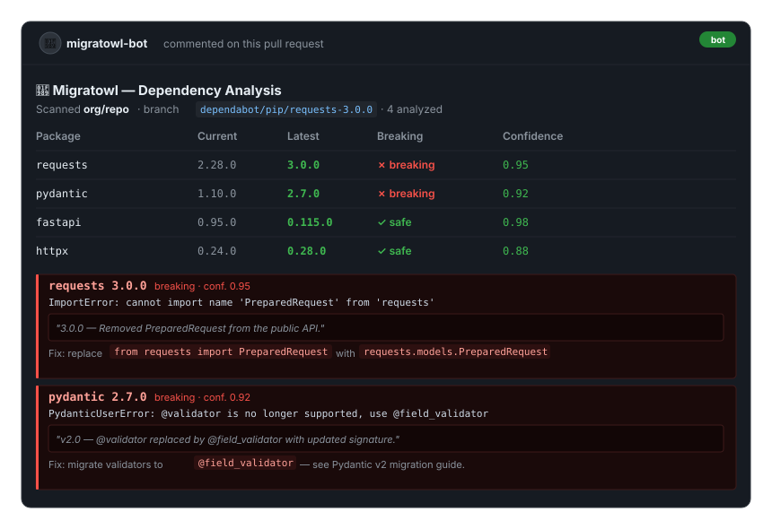
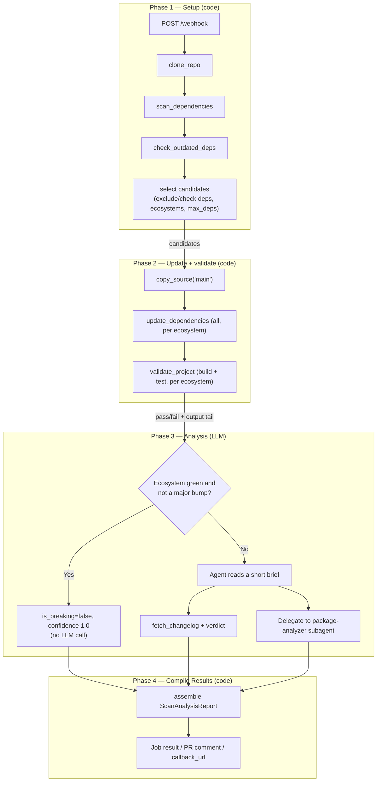
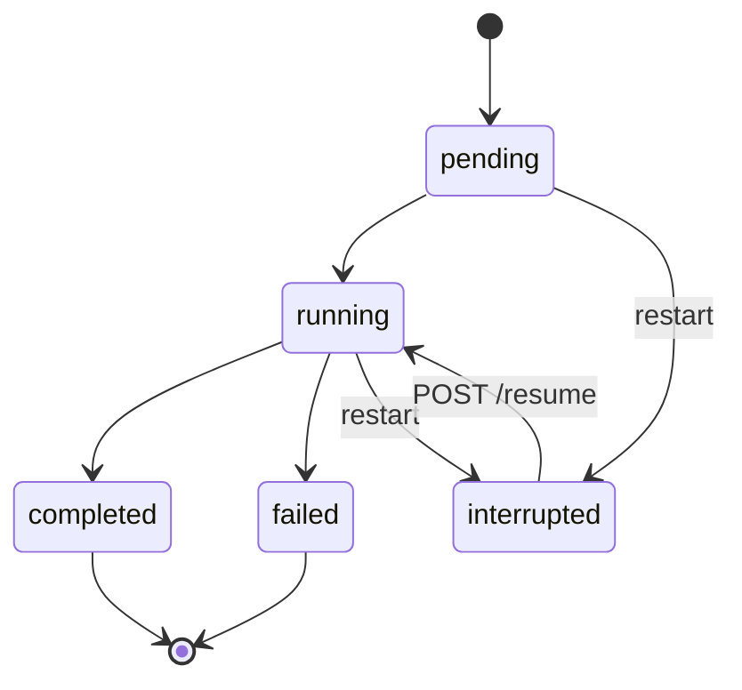
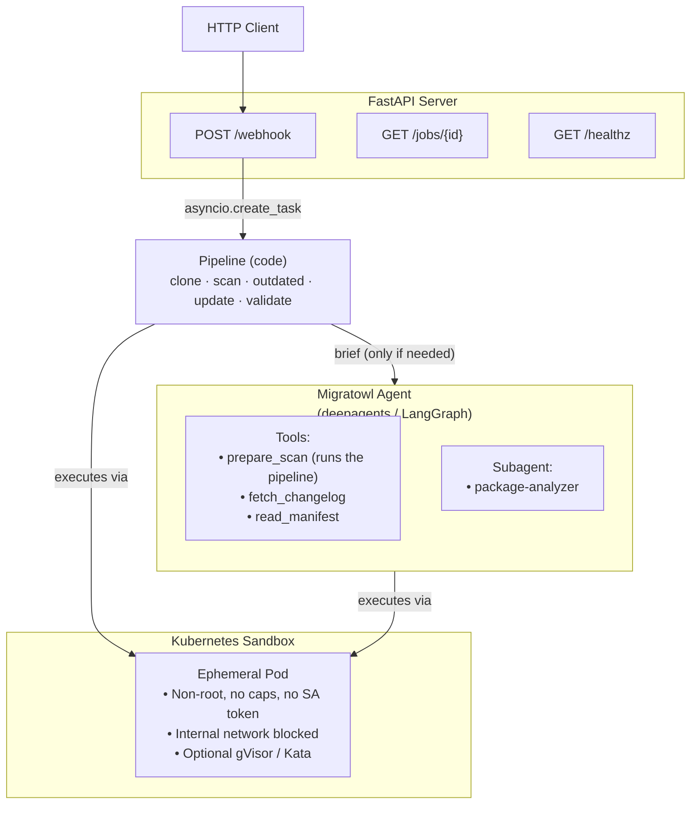

<p align="center">
  
</p>

<h1 align="center">Migratowl</h1>

<p align="center">
  <strong>AI-powered dependency migration analyzer.</strong><br>
  Discovers breaking upgrades, explains exactly what failed, and tells you how to fix it.
</p>

<p align="center">
  
  
  <a href="https://www.bestpractices.dev/projects/12571"></a>
</p>

---

<p align="center">
  
</p>

---

## What It Does

Migratowl answers one question: **"If I upgrade this dependency, will anything break — and how do I fix it?"**

It receives a webhook, clones the target repository, scans all dependency manifests, queries package registries for newer versions, and runs the project inside an isolated Kubernetes sandbox with every dependency bumped. An AI agent executes the test suite, reads the error output, fetches the relevant changelog, and produces a structured report per dependency.

The result tells developers:

- Whether the upgrade is breaking
- What specifically went wrong
- A verbatim citation from the changelog
- A plain-English fix suggestion

---

## Why Not Just Use Snyk, Dependabot, or Your CI Pipeline?

Use them together, not instead. Here is what each one does not do:

**"SemVer already tells me if a major version breaks things."**
It tells you *that* something changed. It does not tell you *which of your files* imports
the removed API, or whether your project even calls the affected code path.

**"I just let CI run on the Dependabot PR."**
CI tells you it failed. Migratowl tells you *why*, links it to a specific changelog entry,
and scores how confident it is in that attribution — for every package in the PR, not just
the one that happened to fail loudest.

**"The LLM is just guessing the confidence score."**
No. Tests run first in an isolated sandbox. The LLM reads the real error output and
decides whether the failure is attributable clearly enough to report, or whether the
package needs an isolated re-run. It is routing logic, not prediction.

**"We have no tests."**
For compiled languages (Go, Rust, Java), build failures are caught automatically — no
tests needed. For interpreted languages (Python, Node.js), a test suite is currently
required to detect runtime breakage. Zero-test support for interpreted ecosystems is
planned.

| | Snyk | SonarQube | Dependabot | Renovate | Your CI | Migratowl |
| --- | :---: | :---: | :---: | :---: | :---: | :---: |
| Security CVE alerts | ✅ | ✅ | ⚠️ | ⚠️ | ❌ | ❌ |
| License compliance | ⚠️ | ✅ | ❌ | ❌ | ❌ | ❌ |
| Automated version-bump PRs | ❌ | ❌ | ✅ | ✅ | ❌ | ❌ |
| Tests run on upgrade | ❌ | ❌ | ❌ | ❌ | ✅ | ✅ |
| No CI config required | ❌ | ❌ | ❌ | ❌ | ❌ | ✅ |
| Which file / call site breaks | ❌ | ❌ | ❌ | ❌ | ❌ | ✅ |
| Changelog-cited explanation | ❌ | ❌ | ❌ | ⚠️ | ❌ | ✅ |

⚠️ = partial &nbsp;&nbsp; ❌ = not in scope

---

## Table of Contents

- [Getting Started](#getting-started)
- [Supported Ecosystems](#supported-ecosystems)
- [How It Works](#how-it-works)
- [Self-Hosted Quick Start](#self-hosted-quick-start)
- [API Reference](#api-reference)
  - [POST /webhook](#post-webhook)
  - [GET /jobs/{job\_id}](#get-jobsjob_id)
  - [GET /jobs?state={state}](#get-jobsstatestate)
  - [POST /jobs/{job\_id}/resume](#post-jobsjob_idresume)
  - [GET /healthz](#get-healthz)
- [Response Schema](#response-schema)
- [Configuration](#configuration)
  - [LLM](#llm)
  - [Kubernetes Sandbox](#kubernetes-sandbox)
  - [Analysis](#analysis)
  - [Jobs and Crash Recovery](#jobs-and-crash-recovery)
  - [HTTP Client](#http-client)
  - [API Server](#api-server)
  - [Git Providers](#git-providers)
  - [Observability](#observability)
- [Kubernetes Setup](#kubernetes-setup)
- [Observability](#observability-1)
- [GitHub Actions](#github-actions)
  - [Option A — No server needed (`ci-only.yml`)](#option-a--no-server-needed-ci-onlyyml)
  - [Option B — Persistent Migratowl server (`with-migratowl-server.yml`)](#option-b--persistent-migratowl-server-with-migratowl-serveryml)
- [Architecture](#architecture)
- [Project Layout](#project-layout)
- [Development](#development)
- [Contributing](#contributing)
- [License](#license)

---

## Getting Started

Choose the path that matches your setup:

### Zero-config (no cluster needed)

For individual developers and small teams with no existing Kubernetes infrastructure. Migratowl spins up a temporary cluster inside the CI runner — nothing to install or host.

**GitHub Actions** — add one workflow file and one secret:

```yaml
name: migratowl
on:
  pull_request:
    branches: [main]
concurrency:
  group: migratowl-${{ github.ref }}
  cancel-in-progress: true
permissions:
  contents: read
  pull-requests: write
  statuses: write
jobs:
  scan:
    runs-on: ubuntu-latest
    steps:
      - uses: bitkaio/migratowl-action@v1
        with:
          anthropic-api-key: ${{ secrets.ANTHROPIC_API_KEY }}
```

See [bitkaio/migratowl-action](https://github.com/bitkaio/migratowl-action) for the full inputs reference, scheduled mode, and GitLab usage.

**GitLab CI** — include the component once:

```yaml
stages: [test]
include:
  - component: gitlab.com/bitkaio/migratowl-gitlab-component/scan@v1
    inputs:
      anthropic-api-key: $ANTHROPIC_API_KEY
      stage: test
```

See [bitkaio/migratowl-gitlab-component](https://gitlab.com/bitkaio/migratowl/migratowl-gitlab-component) for details.

### Self-hosted (existing Kubernetes cluster)

For teams that already operate a Kubernetes cluster and want a persistent Migratowl deployment. Follow the [Self-Hosted Quick Start](#self-hosted-quick-start) below.

---

## Supported Ecosystems

| Language | Manifest files | Lockfiles (installed versions) | Registry |
|----------|----------------|--------------------------------|----------|
| Python | `pyproject.toml` (PEP 621 incl. optional deps, PEP 735 groups, Poetry incl. groups), `requirements.txt` | `uv.lock`, `poetry.lock` | PyPI |
| Node.js | `package.json` | `package-lock.json` | npm |
| Go | `go.mod` | — (`go.mod` pins exact versions) | proxy.golang.org |
| Rust | `Cargo.toml` | `Cargo.lock` | crates.io |
| Java | `pom.xml` (Maven, including `${property}` versions), `build.gradle` / `build.gradle.kts`, `gradle/libs.versions.toml` (Gradle) | — | Maven Central |

When a lockfile sits next to a manifest (or in a parent directory, as in Cargo and uv workspaces), the installed version is compared with the latest release instead of the declared range: `>=2.0` with `2.31.0` installed is only outdated if something newer than `2.31.0` exists. Reports show it as `installed_version`.

---

## How It Works

Migratowl runs inside an ephemeral Kubernetes sandbox. Phases 1–2 are mechanical and run as
plain code (`migratowl/pipeline.py`); the LLM only does the judgement step (Phase 3), and the
final report is assembled in code. This keeps the model's context small, so smaller and free
models can run scans too.


```mermaid
flowchart TB
    subgraph Phase1["Phase 1 — Setup (code)"]
        A[POST /webhook] --> B[clone_repo]
        B --> D[scan_dependencies]
        D --> E[check_outdated_deps]
        E --> S["select candidates<br/>(exclude/check deps, ecosystems, max_deps)"]
    end

    subgraph Phase2["Phase 2 — Update + validate (code)"]
        F["copy_source('main')"] --> G["update_dependencies (all, per ecosystem)"]
        G --> H["validate_project (build + test, per ecosystem)"]
    end

    subgraph Phase3["Phase 3 — Analysis (LLM)"]
        P{"Ecosystem green and<br/>not a major bump?"}
        P -->|Yes| J["is_breaking=false, confidence 1.0<br/>(no LLM call)"]
        P -->|No| K["Agent reads a short brief"]
        K --> L["fetch_changelog + verdict"]
        K --> M["Delegate to package-analyzer subagent"]
    end

    subgraph Phase4["Phase 4 — Compile Results (code)"]
        N["assemble ScanAnalysisReport"]
        N --> O["Job result / PR comment / callback_url"]
    end

    S -->|candidates| F
    H -->|pass/fail + output tail| P
    J --> N
    L --> N
    M --> N
```

**Routing rules** (applied in Phase 3 when tests fail):

- Error message directly names the package → attributed directly; report written
- Import or attribute error for a known package API → attributed directly
- Ambiguous failure with no clear link to a specific package → delegated to an isolated package-analyzer subagent run

The attribution threshold is configurable via `MIGRATOWL_CONFIDENCE_THRESHOLD` (default `0.7`).

**Sandbox workspace layout:**

```text
/home/user/workspace/
├── source/          # Immutable clone — never executed
├── main/            # All deps bumped, executed in Phase 2
├── <package-name>/  # Per-package isolation (created on demand by subagent)
└── .venvs/<folder>/ # One Python venv per working folder (Python projects only)
```

---

## Self-Hosted Quick Start

**Prerequisites:** Python 3.13+, [uv](https://docs.astral.sh/uv/), Docker, minikube, kubectl.

```bash
# 1. Install dependencies
uv sync

# 2. Configure environment
cp .env.example .env
# Edit .env — set at minimum: ANTHROPIC_API_KEY

# 3. Start local Kubernetes cluster
minikube start --driver=docker --memory=8192 --cpus=4

# 4. Install agent-sandbox controller and CRDs
kubectl apply -f https://github.com/kubernetes-sigs/agent-sandbox/releases/download/v0.2.1/manifest.yaml
kubectl apply -f https://github.com/kubernetes-sigs/agent-sandbox/releases/download/v0.2.1/extensions.yaml

# 5. Build sandbox runner image inside minikube
eval $(minikube docker-env)
docker build -t sandbox-runtime:latest k8s/runtime/

# 6. Apply RBAC and sandbox template
kubectl apply -f k8s/rbac.yaml
kubectl apply -f k8s/sandbox-template.yaml

# 7. Start the server
uv run uvicorn migratowl.api.main:app --reload
```

Trigger a scan:

```bash
curl -X POST http://localhost:8000/webhook \
  -H 'Content-Type: application/json' \
  -d '{
    "repo_url": "https://github.com/org/repo",
    "callback_url": "https://yourservice.example.com/results"
  }'
# → {"job_id": "...", "status_url": "/jobs/..."}
```

---

## API Reference

### POST /webhook

Accepts a scan request. Returns `202 Accepted` immediately; analysis runs in the background and POSTs the outcome (report or failure) to `callback_url` when done. When `MIGRATOWL_API_TOKEN` is set, send `Authorization: Bearer <token>` with this and every `/jobs` request.

**Request body** (`ScanWebhookPayload`):

| Field | Type | Default | Description |
|-------|------|---------|-------------|
| `repo_url` | `string` | **required** | Git repository URL to scan |
| `branch_name` | `string` | `"main"` | Branch to clone and analyze |
| `git_provider` | `"github" \| "gitlab"` | `"github"` | Git provider — determines which API is used for PR/MR comments and commit statuses |
| `pr_number` | `integer \| null` | `null` | PR (GitHub) or MR IID (GitLab) — when set, Migratowl posts a comment with the analysis result, or a short failure notice if the scan fails |
| `commit_sha` | `string \| null` | `null` | Full commit SHA — when set (with or without `pr_number`), Migratowl posts a pending status at scan start and a success/failure/error status at the end |
| `callback_url` | `string \| null` | `null` | URL to POST the outcome to: the `ScanAnalysisReport` when the scan completes, or `{job_id, state: "failed", error, repo_url, branch_name}` when it fails. Both requests carry `X-Migratowl-Job-Id` and `X-Migratowl-Job-State` headers |
| `exclude_deps` | `string[]` | `[]` | Dependency names to skip entirely |
| `check_deps` | `string[]` | `[]` | When non-empty, only these dependencies are checked (all others are ignored) |
| `max_deps` | `integer` | `50` | Maximum outdated deps to analyze (must be > 0) |
| `ecosystems` | `string[] \| null` | `null` | Limit to specific ecosystems: `"python"`, `"nodejs"`, `"go"`, `"rust"`, `"java"`. `null` = auto-detect all |
| `mode` | `string` | `"normal"` | Version resolution mode — see below |
| `include_prerelease` | `boolean` | `false` | When `true`, pre-release versions (alpha, beta, RC) are considered when finding the latest version |

**Version resolution modes (`mode`):**

| Mode | Behaviour |
|------|-----------|
| `"safe"` | Respects the declared semver constraint. `^4.21.2` only reports a newer version if one exists **within** the `>=4.21.2,<5.0.0` range. A package already at the top of its pinned range is reported as up-to-date even when a new major exists. |
| `"normal"` | Ignores the constraint operator. `^4.21.2` compares the bare version `4.21.2` against the **globally highest** published version — including major bumps like `5.x`. |

**Example:**

```json
{
  "repo_url": "https://github.com/org/repo",
  "branch_name": "main",
  "git_provider": "github",
  "pr_number": 42,
  "commit_sha": "abc123...",
  "callback_url": "https://yourservice.example.com/results",
  "exclude_deps": ["boto3"],
  "check_deps": [],
  "max_deps": 20,
  "ecosystems": ["python"],
  "mode": "normal",
  "include_prerelease": false
}
```

**202 response** (`WebhookAcceptedResponse`):

```json
{
  "job_id": "3fa85f64-5717-4562-b3fc-2c963f66afa6",
  "status_url": "/jobs/3fa85f64-5717-4562-b3fc-2c963f66afa6"
}
```

---

### GET /jobs/{job_id}

Poll the status of a scan job.

**Response** (`JobStatus`):

| Field | Type | Description |
|-------|------|-------------|
| `job_id` | `string` | UUID assigned at webhook acceptance |
| `state` | `string` | Job lifecycle state (see below) |
| `created_at` | `datetime` | ISO 8601, UTC |
| `updated_at` | `datetime` | ISO 8601, UTC |
| `payload` | `ScanWebhookPayload` | Original request payload |
| `result` | `ScanAnalysisReport \| null` | Set when `state = "completed"` |
| `error` | `string \| null` | Set when `state = "failed"` |
| `retry_count` | `integer` | How many times the job was resumed |

Credentials embedded in `payload.repo_url` are masked in every response.

**Job lifecycle:**


```mermaid
stateDiagram-v2
    [*] --> pending
    pending --> running
    running --> completed
    running --> failed
    pending --> interrupted: restart
    running --> interrupted: restart
    interrupted --> running: POST /resume
    completed --> [*]
    failed --> [*]
```

| State | Meaning |
|-------|---------|
| `pending` | Queued, not yet started (at most `MIGRATOWL_MAX_CONCURRENT_SCANS` scans run at once) |
| `running` | Agent is actively analyzing the repository |
| `completed` | Analysis finished; `result` is populated |
| `failed` | Unrecoverable error; `error` describes what went wrong |
| `interrupted` | The server stopped or crashed while the job was pending or running. Resume it with `POST /jobs/{job_id}/resume` |

**404** when `job_id` is not found.

---

### GET /jobs?state={state}

List jobs in one state, for example `?state=interrupted` to find work a restart left behind. Returns `{"jobs": [JobStatus, ...]}`.

**400** when `state` is missing; **422** when it is not a valid state.

---

### POST /jobs/{job_id}/resume

Resume an `interrupted` job. Returns `202` with the same body as `POST /webhook`. With the default `sqlite` persistence the scan reconnects to its surviving sandbox and continues from the last LangGraph checkpoint; if the sandbox is gone, it starts over from the clone. PR comments and callbacks are not sent twice.

**404** when `job_id` is not found; **409** when the job is not `interrupted` (or another resume already claimed it) or has been resumed more than `MIGRATOWL_MAX_SCAN_RETRIES` times.

---

### GET /healthz

Liveness check. Returns `200 {"status": "ok"}` when the server is running.

---

## Response Schema

The `ScanAnalysisReport` delivered to `callback_url` (and returned in `GET /jobs/{job_id}` when completed):

```text
ScanAnalysisReport
├── repo_url                  string    — repository that was analyzed
├── branch_name               string    — branch that was cloned
├── scan_result               ScanResult
│   ├── all_deps              Dependency[]   — every declared dependency found
│   │   ├── name              string
│   │   ├── current_version   string         — as declared (may be a range)
│   │   ├── installed_version string | null  — from a lockfile, when one exists
│   │   ├── ecosystem         string
│   │   ├── manifest_path     string
│   │   └── version_key       string | null  — pom property / Gradle catalog key holding the version
│   ├── outdated              OutdatedDependency[]  — deps with newer versions
│   │   ├── name              string
│   │   ├── current_version   string
│   │   ├── installed_version string | null
│   │   ├── latest_version    string
│   │   ├── ecosystem         string
│   │   ├── manifest_path     string
│   │   ├── module_path       string | null  — Go: new module path of a new major (…/v2)
│   │   ├── version_key       string | null
│   │   ├── homepage_url      string | null
│   │   ├── repository_url    string | null
│   │   └── changelog_url     string | null
│   ├── manifests_found       string[]  — manifest file paths discovered
│   ├── scan_duration_seconds float
│   └── registry_failures     RegistryFailure[]  — deps whose registry lookup failed
│       ├── name              string
│       └── ecosystem         string
├── reports                   AnalysisReport[]  — one per analyzed package
│   ├── dependency_name       string
│   ├── is_breaking           bool
│   ├── error_summary         string    — what failed (empty if not breaking)
│   ├── changelog_citation    string    — verbatim excerpt from changelog
│   ├── suggested_human_fix   string    — plain-English remediation step
│   └── confidence            float     — 0.0–1.0, how sure the verdict is
├── skipped                   string[]  — package names not analyzed
├── total_duration_seconds    float
├── total_input_tokens        int       — includes cache reads and writes
├── total_output_tokens       int
├── total_cache_read_tokens   int
├── total_cache_creation_tokens int
└── model_name                string    — model that produced the analysis
```

**Example report entry:**

```json
{
  "dependency_name": "requests",
  "is_breaking": true,
  "error_summary": "ImportError: cannot import name 'PreparedRequest'",
  "changelog_citation": "## 3.0.0 — Removed PreparedRequest from the public API.",
  "suggested_human_fix": "Replace `from requests import PreparedRequest` with `requests.models.PreparedRequest`.",
  "confidence": 0.9
}
```

---

## Configuration

All `MIGRATOWL_*` variables are optional (defaults shown). Third-party SDK keys use their standard names without the `MIGRATOWL_` prefix.

### LLM

| Variable | Default | Description |
|----------|---------|-------------|
| `ANTHROPIC_API_KEY` | — | Required when `MIGRATOWL_MODEL_PROVIDER=anthropic` (default) |
| `OPENAI_API_KEY` | — | Required when `MIGRATOWL_MODEL_PROVIDER=openai` or `litellm` |
| `MIGRATOWL_MODEL_PROVIDER` | `anthropic` | LLM provider: `anthropic`, `openai`, or `litellm` |
| `MIGRATOWL_MODEL_NAME` | `claude-sonnet-5-5` | Model name (must match provider) |
| `MIGRATOWL_MODEL_ALIAS` | — | Override model name sent to provider (for proxies with different naming) |
| `MIGRATOWL_MODEL_RATE_LIMIT_RPS` | `0.1` | Max LLM requests/second (0.1 = 6 req/min) |
| `ANTHROPIC_BASE_URL` | — | Custom base URL for Anthropic API (`MIGRATOWL_ANTHROPIC_BASE_URL` also works) |
| `OPENAI_BASE_URL` | — | Custom base URL for OpenAI API (`MIGRATOWL_OPENAI_BASE_URL` also works) |
| `LITELLM_BASE_URL` | — | LiteLLM unified proxy endpoint (use with `MIGRATOWL_MODEL_PROVIDER=litellm`; `MIGRATOWL_LITELLM_BASE_URL` also works) |

#### Using an LLM Proxy

For developers routing through corporate proxies (LiteLLM, Azure API Management, etc.):

**Pattern 1 — Provider-specific proxy** (Anthropic/OpenAI compatible):

```bash
ANTHROPIC_BASE_URL=https://proxy.mycompany.com/anthropic/v1
ANTHROPIC_API_KEY=<proxy-provided-key>
MIGRATOWL_MODEL_ALIAS=anthropic--claude-sonnet-latest  # if proxy uses different naming
```

**Pattern 2 — LiteLLM unified proxy** (one endpoint for all providers):

```bash
MIGRATOWL_MODEL_PROVIDER=litellm
LITELLM_BASE_URL=https://proxy.mycompany.com/v1
OPENAI_API_KEY=<proxy-provided-key>
MIGRATOWL_MODEL_NAME=anthropic--claude-sonnet-latest
```

See [`docs/proxy-setup.md`](docs/proxy-setup.md) for troubleshooting, model name mapping, and additional examples.

### Kubernetes Sandbox

| Variable | Default | Description |
|----------|---------|-------------|
| `MIGRATOWL_SANDBOX_MODE` | `agent-sandbox` | `agent-sandbox` (requires controller + CRDs) or `raw` (any cluster, no CRDs) |
| `MIGRATOWL_SANDBOX_TEMPLATE` | `migratowl-sandbox-template` | agent-sandbox `AgentSandboxTemplate` name (agent-sandbox mode only) |
| `MIGRATOWL_SANDBOX_NAMESPACE` | `default` | Kubernetes namespace for sandbox pods |
| `MIGRATOWL_SANDBOX_CONNECTION_MODE` | `tunnel` | Connection mode: `tunnel` or `direct` (agent-sandbox mode only) |
| `MIGRATOWL_SANDBOX_KUBE_API_URL` | in-cluster URL | Kubernetes API used to list and delete SandboxClaims (agent-sandbox mode only). Off-cluster, run `kubectl proxy` and set `http://localhost:8001`; otherwise TTL sweep and shutdown cleanup can't run |
| `MIGRATOWL_SANDBOX_KUBE_TOKEN` | — | Bearer token for `MIGRATOWL_SANDBOX_KUBE_API_URL` (not needed with `kubectl proxy` or in-cluster) |
| `MIGRATOWL_SANDBOX_IMAGE` | `ghcr.io/bitkaio/migratowl-runtime:latest` | Container image for sandbox pods (raw mode only). The default bundles git and every supported toolchain (built from `k8s/runtime/`). A custom image must include `git`, `python3` and the toolchains for the ecosystems you scan — slim language images such as `python:3.13-slim` have no `git`, so the clone fails. |
| `MIGRATOWL_SANDBOX_PYTHON_VERSION` | `3.13` | Python version in the sandbox image. PyPI releases whose `requires_python` excludes it are not suggested as upgrades (they could not be installed). Change it if you use a custom image with another Python |
| `MIGRATOWL_SANDBOX_BLOCK_NETWORK` | `true` | Attach deny-all `NetworkPolicy` to sandbox pods (raw mode only; requires Calico/Cilium — kindnet ignores it). Apply `k8s/sandbox-egress-raw.yaml` so scans can still reach DNS, git hosts and registries |
| `MIGRATOWL_WORKSPACE_PATH` | `/home/user/workspace` | Workspace root inside the sandbox |

### Analysis

| Variable | Default | Description |
|----------|---------|-------------|
| `MIGRATOWL_CONFIDENCE_THRESHOLD` | `0.7` | Packages above this are analyzed directly; below → subagent |
| `MIGRATOWL_SCAN_REGISTRY_CONCURRENCY` | `10` | Concurrent registry queries when checking outdated deps |
| `MIGRATOWL_MAX_OUTPUT_CHARS` | `30000` | Truncation limit for sandbox command output |
| `MIGRATOWL_ANALYSIS_TAIL_CHARS` | `4000` | Characters of failing build/test output (the tail) included in the LLM's analysis brief |
| `MIGRATOWL_MAX_CHANGELOG_CHARS` | `15000` | Truncation limit for fetched changelogs |
| `MIGRATOWL_MAX_OUTDATED_DEPS` | `100` | Hard cap on registry scan results |

### Jobs and Crash Recovery

| Variable | Default | Description |
|----------|---------|-------------|
| `MIGRATOWL_PERSISTENCE_BACKEND` | `sqlite` | `sqlite` keeps jobs and agent checkpoints on disk so scans survive a restart and can be resumed; `memory` keeps nothing (CI, one-shot runs) |
| `MIGRATOWL_JOBS_DB_PATH` | `./migratowl_jobs.db` | SQLite job store (`sqlite` backend only) |
| `MIGRATOWL_CHECKPOINT_DB_PATH` | `./migratowl_checkpoints.db` | SQLite LangGraph checkpoints (`sqlite` backend only) |
| `MIGRATOWL_MAX_SCAN_RETRIES` | `3` | How often a job may be resumed; past it, an interrupted job is marked `failed` |
| `MIGRATOWL_MAX_CONCURRENT_SCANS` | `1` | Scans that run at once; the rest wait as `pending`. Each scan has its own sandbox pod, so this bounds cluster and LLM load |
| `MIGRATOWL_SANDBOX_TTL_IDLE_SECONDS` | `1800` | Sandboxes idle for longer are deleted by the startup sweep (leaked by a crash) |
| `MIGRATOWL_SANDBOX_TTL_SECONDS` | — | Absolute sandbox lifetime. Unset by default so long builds are not killed mid-scan |

Run a single server process per database: on startup it marks every `pending` or `running` job it finds as `interrupted`.

### HTTP Client

| Variable | Default | Description |
|----------|---------|-------------|
| `MIGRATOWL_HTTP_TIMEOUT` | `30.0` | Outbound request timeout (seconds) |
| `MIGRATOWL_HTTP_RETRY_COUNT` | `3` | Retries on 429 / 5xx responses |
| `MIGRATOWL_HTTP_RETRY_BACKOFF_BASE` | `0.5` | Base delay (seconds) for exponential backoff |

### API Server

| Variable | Default | Description |
|----------|---------|-------------|
| `MIGRATOWL_LOG_LEVEL` | `INFO` | Log level for Migratowl's own messages (`DEBUG`, `INFO`, `WARNING`, `ERROR`); at `INFO` each scan logs its candidates, update failures and validation result per ecosystem |
| `MIGRATOWL_API_TOKEN` | — | When set, `POST /webhook` and all `/jobs` endpoints require `Authorization: Bearer <token>` (`/healthz` stays open). Set it whenever the server is reachable from anything but localhost; the server logs a warning at startup when it is unset |
| `MIGRATOWL_CALLBACK_ALLOW_PRIVATE` | `false` | Allow `callback_url` to target private, loopback or link-local addresses. By default such URLs are rejected with `422`, hostnames are resolved again before the callback is sent, and redirects are not followed |
| `MIGRATOWL_API_HOST` | `0.0.0.0` | Bind address |
| `MIGRATOWL_API_PORT` | `8000` | Bind port |

### Git Providers

| Variable | Default | Description |
|----------|---------|-------------|
| `GITHUB_TOKEN` | — | GitHub personal access token; needs `repo:status` and `public_repo` (or `repo` for private repos) scopes to post PR comments and commit statuses |
| `GITHUB_API_URL` | `https://api.github.com` | Override for GitHub Enterprise Server (e.g. `https://github.corp.com/api/v3`) |
| `GITLAB_TOKEN` | — | GitLab personal access token with `api` scope; needed to post MR comments and commit statuses |
| `GITLAB_API_URL` | `https://gitlab.com/api/v4` | Override for self-hosted GitLab |

### Observability

| Variable | Default | Description |
|----------|---------|-------------|
| `LANGFUSE_PUBLIC_KEY` | — | Enables LangFuse tracing when both keys are set |
| `LANGFUSE_SECRET_KEY` | — | See above |
| `LANGFUSE_HOST` | `https://cloud.langfuse.com` | LangFuse instance URL |

---

## Kubernetes Setup

Migratowl uses [langchain-kubernetes](https://github.com/barnakun/langchain-kubernetes) (installed from that repository's `py-0.4.1` tag) in **agent-sandbox mode** by default, which requires the [`kubernetes-sigs/agent-sandbox`](https://github.com/kubernetes-sigs/agent-sandbox) controller and CRDs installed in your cluster. This provides warm pod pools and, once you set a gVisor or Kata `runtimeClassName` in the template, kernel-level isolation.

```bash
# Install controller + CRDs (one-time)
kubectl apply -f https://github.com/kubernetes-sigs/agent-sandbox/releases/download/v0.2.1/manifest.yaml
kubectl apply -f https://github.com/kubernetes-sigs/agent-sandbox/releases/download/v0.2.1/extensions.yaml

# Build runtime image (must be visible to the cluster — use minikube docker-env locally)
eval $(minikube docker-env)
docker build -t sandbox-runtime:latest k8s/runtime/

# Apply manifests
kubectl apply -f k8s/rbac.yaml
kubectl apply -f k8s/sandbox-template.yaml
```

**Optional warm pool** (reduces cold-start latency):

```bash
kubectl apply -f k8s/warm-pool.yaml
```

**Raw mode** — if you can't install the agent-sandbox controller (locked-down clusters, CI environments), switch to raw mode. No CRDs required — Migratowl manages ephemeral pods directly:

```bash
MIGRATOWL_SANDBOX_MODE=raw          # set in .env
MIGRATOWL_SANDBOX_IMAGE=ghcr.io/bitkaio/migratowl-runtime:latest  # default; needs git + toolchains
MIGRATOWL_SANDBOX_BLOCK_NETWORK=true  # requires Calico/Cilium; set false for kind (kindnet ignores NetworkPolicy)
```

Apply the raw-mode RBAC instead of the default one, plus the sandbox egress policy:

```bash
kubectl apply -f k8s/rbac-raw.yaml
kubectl apply -f k8s/sandbox-egress-raw.yaml
```

With `MIGRATOWL_SANDBOX_BLOCK_NETWORK=true`, every sandbox pod gets a deny-all `NetworkPolicy`. On a CNI that enforces it, that also blocks DNS, `git clone` and package installs, so the scan can't fetch anything. `k8s/sandbox-egress-raw.yaml` re-opens DNS and HTTP/HTTPS to public addresses only. Apply it in every namespace that runs sandboxes.

**Sandbox pod security:**

| | agent-sandbox mode (`k8s/sandbox-template.yaml`) | raw mode (set by langchain-kubernetes) |
|---|---|---|
| User | `runAsNonRoot`, UID/GID 1000 | `runAsNonRoot`, UID 1000 |
| Privileges | `allowPrivilegeEscalation: false`, `capabilities.drop: [ALL]`, seccomp `RuntimeDefault` | same |
| Service account token | not mounted | not mounted |
| Network | agent-sandbox's managed policy: cluster IPs, VPC subnets and node metadata blocked; external egress open | deny-all per pod; with `k8s/sandbox-egress-raw.yaml`, DNS plus ports 80/443 to public addresses only |
| Kernel isolation | opt-in: install gVisor or Kata and set `runtimeClassName` in the template | not available |

---

## Observability

Migratowl integrates with [LangFuse](https://langfuse.com) for trace-level observability. Tracing is off by default and activates when both keys are present.

```bash
# .env
LANGFUSE_PUBLIC_KEY=pk-lf-...
LANGFUSE_SECRET_KEY=sk-lf-...
LANGFUSE_HOST=https://cloud.langfuse.com   # or your self-hosted instance
```

When enabled, every scan produces a LangFuse session (keyed by `job_id`) containing:

- **Main agent trace** — all LLM calls and tool invocations
- **Tool call spans** — `clone_repo`, `scan_dependencies`, `execute_project`, etc.
- **Subagent spans** — `package-analyzer` subagent runs nested under the parent trace

No additional code changes are needed — the `observability.py` module initializes the handler at startup and patches the LangGraph graph to inject session IDs automatically.

---

## GitHub Actions

Two ready-to-use example workflows are in [`docs/examples/`](docs/examples/). Both trigger on Dependabot PRs (targeted single-dep scan) and on `workflow_dispatch` (manual full scan).

### Option A — No server needed (`ci-only.yml`)

Spins up a temporary kind cluster and Migratowl instance inside the runner. Nothing to host.

**Setup (2 steps):**

1. Copy [`docs/examples/ci-only.yml`](docs/examples/ci-only.yml) into `.github/workflows/` in your repo
2. Add one repository secret: `ANTHROPIC_API_KEY` (Settings → Secrets and variables → Actions → New repository secret)

That's it. The built-in `GITHUB_TOKEN` is used automatically for PR comments.

### Option B — Persistent Migratowl server (`with-migratowl-server.yml`)

Triggers your existing Migratowl deployment via webhook. Near-instant trigger, no cluster spin-up in CI.

**Setup:**

1. Copy [`docs/examples/with-migratowl-server.yml`](docs/examples/with-migratowl-server.yml) into `.github/workflows/`
2. Add a repository Actions variable `MIGRATOWL_URL` pointing at your deployment (Settings → Secrets and variables → Actions → Variables), e.g. `https://migratowl.yourcompany.com`
3. Ensure your Migratowl instance has `GITHUB_TOKEN` set with `repo:status` and `public_repo` scopes (or `repo` for private repos)

**For GitLab**, change `"git_provider": "github"` to `"gitlab"` in the payload and configure:

```bash
GITLAB_TOKEN=glpat-...
GITLAB_API_URL=https://gitlab.com/api/v4   # or your self-hosted URL
```

**GitHub Enterprise Server** — set `GITHUB_API_URL` on your Migratowl instance:

```bash
GITHUB_API_URL=https://github.corp.com/api/v3
```

---

## Architecture


```mermaid
flowchart TB
    subgraph API["FastAPI Server"]
        W["POST /webhook"]
        J["GET /jobs/{id}"]
        H["GET /healthz"]
    end

    Pipe["Pipeline (code)<br/>clone · scan · outdated · update · validate"]

    subgraph Agent["Migratowl Agent<br/>(deepagents / LangGraph)"]
        direction TB
        Tools["Tools:<br/>• prepare_scan (runs the pipeline)<br/>• fetch_changelog<br/>• read_manifest"]
        Sub["Subagent:<br/>• package-analyzer"]
    end

    subgraph Sandbox["Kubernetes Sandbox<br/>(langchain-kubernetes)"]
        Pod["Ephemeral Pod<br/>• Non-root, no caps, no SA token<br/>• Internal network blocked<br/>• Optional gVisor / Kata"]
    end

    Client["HTTP Client"] --> W
    W -->|"asyncio.create_task"| Pipe
    Pipe -->|"brief (only if needed)"| Agent
    Pipe -->|"executes via"| Pod
    Agent -->|"executes via"| Pod
```

---

## Project Layout

```text
migratowl/
├── api/
│   ├── main.py          # FastAPI app: /webhook, /jobs, /healthz, lifespan, auth, scan runner
│   ├── jobs.py          # JobStore interface + in-memory store
│   ├── sqlite_jobs.py   # Durable SQLite JobStore (crash recovery)
│   ├── checkpoint.py    # LangGraph checkpointer (SQLite or memory)
│   ├── reconcile.py     # On startup: orphaned pending/running jobs → interrupted
│   ├── resume.py        # Resume: reconnect to the surviving sandbox or start over
│   └── helpers.py       # extract_verdicts, assemble_report
├── agent/
│   ├── graph.py         # graph singleton + sandbox lifecycle (langgraph.json entrypoint)
│   ├── factory.py       # build_tools(), create_migratowl_agent() — builds the LangGraph
│   ├── sandbox.py       # KubernetesSandboxManager construction
│   ├── subagents.py     # package-analyzer subagent definition
│   ├── session_graph.py # Patches ainvoke/astream to inject LangFuse session IDs
│   └── tools/
│       ├── clone.py     # clone_repo, copy_source
│       ├── detect.py    # detect_languages
│       ├── scan.py      # scan_dependencies (manifests + lockfiles)
│       ├── registry.py  # check_outdated_deps
│       ├── update.py    # update_dependencies
│       ├── validate.py  # validate_project (install, build, test per ecosystem)
│       ├── execute.py   # execute_project (runs install + test in sandbox)
│       ├── changelog.py # fetch_changelog (PyPI / npm / GitHub / raw HTTP)
│       ├── manifest.py  # read_manifest, patch_manifest (sandbox file I/O)
│       └── prepare.py   # prepare_scan (pipeline as an agent tool, for deep-agents-ui)
├── git/
│   ├── formatter.py     # ScanAnalysisReport → PR/MR comment (escaped Markdown)
│   ├── github.py        # GitHub PR comments and commit statuses
│   ├── gitlab.py        # GitLab MR comments and commit statuses
│   └── notify.py        # Picks the provider and posts after a scan
├── models/
│   └── schemas.py       # All Pydantic models (ScanWebhookPayload, ScanAnalysisReport, …)
├── pipeline.py          # Deterministic Phases 1–2, presolve, LLM brief
├── config.py            # pydantic-settings Settings class (MIGRATOWL_ prefix)
├── logging_setup.py     # MIGRATOWL_LOG_LEVEL and the fallback log handler
├── observability.py     # LangFuse CallbackHandler setup + session ID injection
├── registry.py          # Registry queries (PyPI, npm, crates.io, Go proxy, Maven Central)
├── parsers.py           # Manifest and lockfile parsers per ecosystem
├── changelog.py         # Changelog fetch strategies (multi-strategy fallback)
├── patches.py           # Monkey-patches for third-party library bugs
└── http.py              # Shared HTTPX async client with retry logic

k8s/
├── rbac.yaml            # RBAC for agent-sandbox mode (manages Sandbox CRs)
├── rbac-raw.yaml        # RBAC for raw mode (manages Pods + NetworkPolicies directly)
├── sandbox-egress-raw.yaml # Raw mode: allow DNS + public HTTP(S) egress from sandbox pods
├── sandbox-template.yaml# AgentSandboxTemplate CRD for the runner pod
├── warm-pool.yaml       # Optional warm pool for faster pod startup
├── sandbox-router.yaml  # Optional sandbox router service
├── sandbox-router/      # Sandbox router image source
└── runtime/             # Dockerfile + entrypoint for the sandbox runner image

tests/                   # Mirrors migratowl/ package structure
```

---

## Development

| Task | Command |
|------|---------|
| Install | `uv sync` |
| Run | `uv run uvicorn migratowl.api.main:app --reload` |
| Test | `uv run pytest tests/ -v` |
| Lint | `uv run ruff check migratowl/` |

**TDD is mandatory** for all production code in `migratowl/`. The Red-Green-Refactor cycle is enforced: write a failing test first, confirm RED, write minimal code to pass, confirm GREEN, then refactor. No production code without a corresponding test in `tests/`.

---

## Contributing

See [CONTRIBUTING.md](CONTRIBUTING.md). All contributors must sign the [CLA](CLA.md).

1. Open an issue first
2. Branch: `issue/<NUMBER>-short-description`
3. Write a failing test before any production code (TDD — no exceptions)
4. Open a PR with `Closes #<NUMBER>`

---

## License

Apache 2.0 — see [LICENSE](LICENSE).
