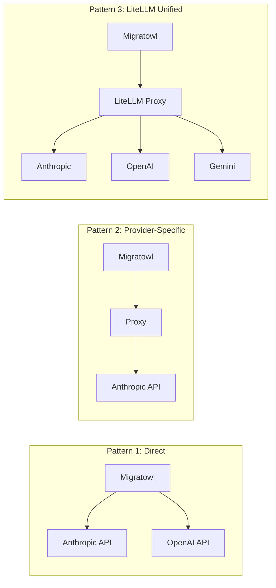

# LLM Proxy Configuration

This guide explains how to configure Migratowl to use an LLM proxy instead of direct API access.

## When You Need a Proxy

Many organizations route LLM traffic through internal proxies for:

- **Cost tracking** — centralized billing and usage monitoring
- **Access control** — SSO authentication, audit logs
- **Compliance** — data residency, traffic inspection
- **Rate limiting** — shared quotas across teams

Common proxy solutions include:
- [LiteLLM](https://github.com/BerriAI/litellm) — unified OpenAI-compatible API for 100+ LLMs
- Azure API Management
- AWS API Gateway
- Custom reverse proxies

## Configuration Patterns

Migratowl supports three proxy patterns:



### Pattern 1: Direct API (Default)

No proxy — calls go directly to the provider's API.

```bash
# .env
ANTHROPIC_API_KEY=sk-ant-...
# or
OPENAI_API_KEY=sk-...
MIGRATOWL_MODEL_PROVIDER=openai
```

### Pattern 2: Provider-Specific Proxy

Route calls through a proxy that speaks the provider's native API.

```bash
# .env — Anthropic-compatible proxy
ANTHROPIC_BASE_URL=https://proxy.mycompany.com/anthropic/v1
ANTHROPIC_API_KEY=<proxy-provided-key>

# Optional: if the proxy uses different model names
MIGRATOWL_MODEL_ALIAS=anthropic--claude-sonnet-latest
```

```bash
# .env — OpenAI-compatible proxy
MIGRATOWL_MODEL_PROVIDER=openai
OPENAI_BASE_URL=https://proxy.mycompany.com/openai/v1
OPENAI_API_KEY=<proxy-provided-key>
MIGRATOWL_MODEL_NAME=gpt-4o
```

### Pattern 3: LiteLLM Unified Proxy

Use a single OpenAI-compatible endpoint that routes to any provider (Claude, GPT, Gemini, etc.).

```bash
# .env
MIGRATOWL_MODEL_PROVIDER=litellm
LITELLM_BASE_URL=http://localhost:6655/litellm/v1
OPENAI_API_KEY=<proxy-provided-key>
MIGRATOWL_MODEL_NAME=anthropic--claude-sonnet-latest
```

The `litellm` provider tells Migratowl to use the OpenAI SDK but point it at your LiteLLM endpoint.

## Model Name Mapping

Proxies often use different model identifiers than the direct APIs:

| Direct API | Proxy (example) |
|------------|-----------------|
| `claude-sonnet-5` | `anthropic--claude-sonnet-latest` |
| `gpt-4o` | `openai--gpt-4o` |

Use `MIGRATOWL_MODEL_ALIAS` to override the model name sent to the proxy while keeping your `.env` consistent across environments:

```bash
# Default model for direct API
MIGRATOWL_MODEL_NAME=claude-sonnet-5

# Override for proxy (only when using a proxy)
MIGRATOWL_MODEL_ALIAS=anthropic--claude-sonnet-latest
```

If `MIGRATOWL_MODEL_ALIAS` is set, it takes precedence over `MIGRATOWL_MODEL_NAME`.

## Environment Variable Reference

| Variable | Description |
|----------|-------------|
| `MIGRATOWL_MODEL_PROVIDER` | `anthropic` (default), `openai`, or `litellm` |
| `MIGRATOWL_MODEL_NAME` | Model identifier (e.g., `claude-sonnet-5`) |
| `MIGRATOWL_MODEL_ALIAS` | Override model name for proxy (optional) |
| `ANTHROPIC_BASE_URL` | Anthropic-compatible proxy URL |
| `OPENAI_BASE_URL` | OpenAI-compatible proxy URL |
| `LITELLM_BASE_URL` | LiteLLM unified proxy URL |

All `*_BASE_URL` variables also accept a `MIGRATOWL_` prefix (e.g., `MIGRATOWL_ANTHROPIC_BASE_URL`).

## Troubleshooting

### "Model not found" errors

The proxy may use different model identifiers. Check your proxy's documentation and set `MIGRATOWL_MODEL_ALIAS` accordingly.

### Authentication failures

Ensure you're using the API key format your proxy expects. Some proxies issue their own keys; others pass through to the upstream provider.

### Connection refused

Verify `*_BASE_URL` is correct and includes the path (e.g., `/v1` or `/anthropic/v1`). Test with curl:

```bash
curl -I https://proxy.mycompany.com/anthropic/v1/messages
```

### Rate limiting

Proxies may enforce their own rate limits. Adjust `MIGRATOWL_MODEL_RATE_LIMIT_RPS` if you hit limits:

```bash
MIGRATOWL_MODEL_RATE_LIMIT_RPS=0.05  # 3 requests/minute
```
